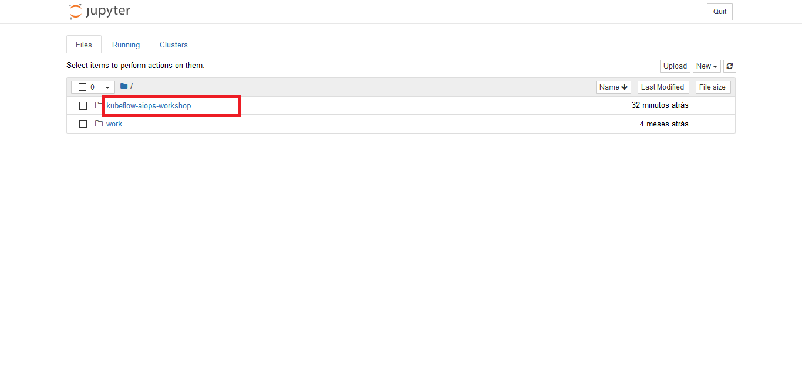

author:            Fabio Beranizo Lopes
summary:           Kubeflow AIops
id:                kubeflow-aiops-aifest2019
categories:        cloud
status:            draft
feedback link:     github.com/fberanizo/kubeflow-aiops-workshop

# Kubeflow AIops

## Overview
Duration: 0:03:00

[Kubeflow](https://www.kubeflow.org/) is a machine learning toolkit for [Kubernetes](https://kubernetes.io/). The project is dedicated to making **deployments** of machine learning (ML) workflows on Kubernetes simple, portable, and scalable. The goal is to provide a straightforward way to deploy best-of-breed open-source systems for ML to diverse infrastructures.

### What You'll Learn

* How to setup a Notebook Server and run small experiments
* How to parametrize Jupyter Notebooks Runs using [Papermill](https://github.com/nteract/papermill) and [Kubeflow Pipelines](https://www.kubeflow.org/docs/pipelines/overview/pipelines-overview/)
* How to create a Serverless Inferencing Service using [KFService](https://www.kubeflow.org/docs/components/serving/kfserving/)

## Access your Environment
Duration: 0:02:00

Head to [this spreadsheet](https://docs.google.com/spreadsheets/d/1EaPveCBYsnIO9TxjkVqpjTHGpZMJ5PVaepfYpW5mAFA/edit?usp=sharing) and pick one URL for yourself.

**CLICK ON THE CHECKBOX, SO THE OTHER PARTICIPANTS KNOW THIS URL IS YOURS.**

1. Open the URL in your web browser.

2. Click on Start Setup.


3. Click on Finish. **Use `anonymous` as the namespace name.**


### Great! Your Kubeflow instance is ready!

## Create your own Notebook Server
Duration: 0:10:00

Your Kubeflow deployment includes services for spawning and managing Jupyter notebooks.

You can set up multiple notebook servers per Kubeflow deployment. Each notebook server can include multiple notebooks. Each notebook server belongs to a single namespace, which corresponds to the project group or team for that server.

1. Click Notebook Servers in the left-hand panel of the Kubeflow UI.


2. Click on **New Server**.


3. Click on **Select Namespace**. Then, click on **anonymous**


4. Specify a name for your Notebook Server. **Only lowercase, hiphen (-), and underscore (_)**


5. Click on **Custom Image**. Then copy-paste the following URL:
`gcr.io/kubeflow-aifest-2019/jupyter`


6. Click on **Don't use Persistent Storage for User's home**.


7. Click **Launch** to create the notebook server.

**Tip:** If you have GPUs available, you can schedule your server on a GPU node in the Extra Resources section at the bottom of the form. For example, to reserve two GPUs, enter the following JSON code:
```{"nvidia.com/gpu": 2}```

8. When the notebook server is available, click **Connect** to connect to it.


9. If you see a message "no healthy upstream". Wait a few seconds, then refresh the page.


### Congrats! Now you'll be able to run notebooks!

## Run Local Experiments
Duration: 0:15:00

### Experiment with your notebook

1. Click on **kubeflow-aiops-workshop**.


2. Then, click on **notebooks**.


3. Click on **01-getting-started.ipynb**.


4. Run the code.


### Now, wait until all cells complete, you should see these results:

1. Preview some random examples of the images from the dataset:


2. The accuracy with respect to the number of epochs:


### Well done! Now, let's create a pipeline so we can easily run this notebook with different parameters.

## Create a Pipeline for Training
Duration: 0:15:00

A pipeline is a description of an ML workflow, including all of the components in the workflow and how they combine in the form of a graph.

The components of a pipeline are a self-contained set of user code, packaged as a Docker image, that performs one step in the pipeline. For example, a component can be responsible for data preprocessing, data transformation, model training, and so on.

### Parametrize your notebook

1. Add a cell that will receive parameters. Then add a tag "parameters" to that cell.


### Use the Kubeflow Pipelines SDK to build components and pipelines

1. Return to the Jupyter Dashboard. Then click on **02-create-a-pipeline.ipynb**.


2. Run the code.


3. Click on **Download**.


### Upload and share it on the Kubeflow Pipelines UI.

1. Click Pipelines in the left-hand panel of the Kubeflow UI.


2. Upload pipeline to kubeflow, then specify a pipeline name


3. Click on the pipeline name


4. Click Create Run


5. Specify a name for your Run.


6. Click Start


### Follow the progress

1. Click on the name of your Run


2. Click on the box named train


3. Click on Logs


4. When the run completes, you should see a green status icon:


### View the metadata that the workflows produced

1. Click on Artifact Store in the left-hand panel of the Kubeflow UI.


2. Click on any artifact name


### Nice! Feel free to change the parameters and view the results.

## Create a Serverless Inferencing Service
Duration: 0:15:00

[KFServing](https://www.kubeflow.org/docs/components/serving/kfserving/) enables serverless inferencing on Kubernetes and provides performant, high abstraction interfaces for common machine learning (ML) frameworks like TensorFlow, XGBoost, scikit-learn, PyTorch, and ONNX to solve production model serving use cases.

### Create a Pipeline that starts an inferencing service

1. Return to the Jupyter Dashboard. Then click on **03-create-inferencing service.ipynb**.


2. Run the code.


3. Click on **Download**.


### Upload and share it on the Kubeflow Pipelines UI.

1. Click Pipelines in the left-hand panel of the Kubeflow UI.


2. Upload pipeline to kubeflow, then specify a pipeline name


3. Click on the pipeline name


4. Click Create Run


5. Specify a name for your Run


6. Specify the model you want to deploy (copy the **Version ID** from any model at Artifact Store)


7. Specify the subdomain


8. Click Start


## Congratulations


### What's next?

Re-live this workshop:
- [github.com/fberanizo/kubeflow-aiops-workshop](https://github.com/fberanizo/kubeflow-aiops-workshop)

Join the Kubeflow Community:

- [github.com/kubeflow](https://github.com/kubeflow)
- [Kubeflow Slack](https://kubeflow.slack.com/join/shared_invite/enQtNDg5MTM4NTQyNjczLTdkNTVhMjg1ZTExOWI0N2QyYTQ2MTIzNTJjMWRiOTFjOGRlZWEzODc1NzMwNTMwM2EzNjY1MTFhODczNjk4MTk)

### Further reading

- [Kubeflow documentation](https://www.kubeflow.org/docs/)
